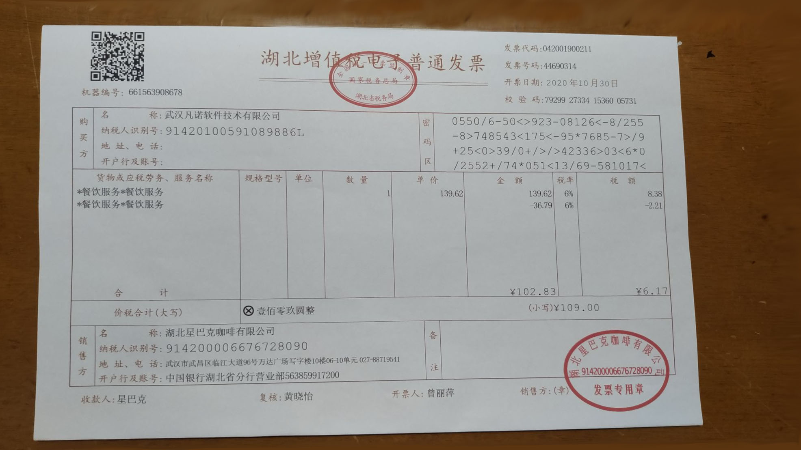
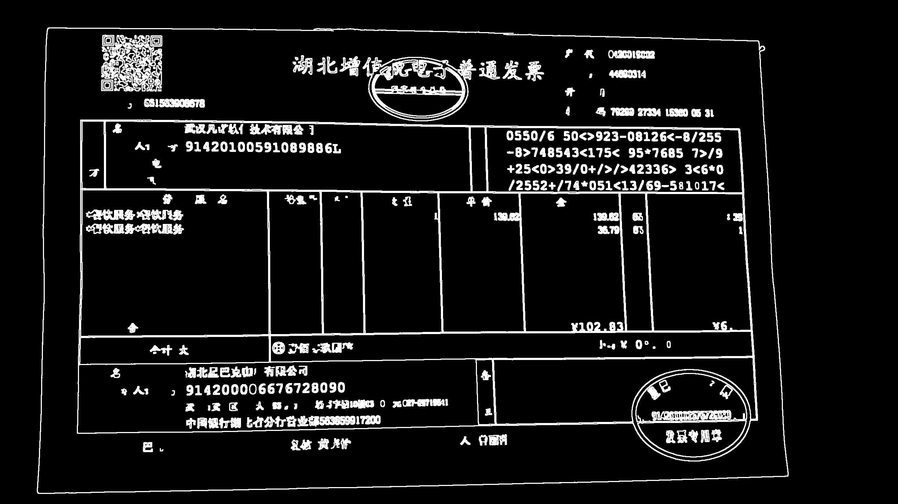
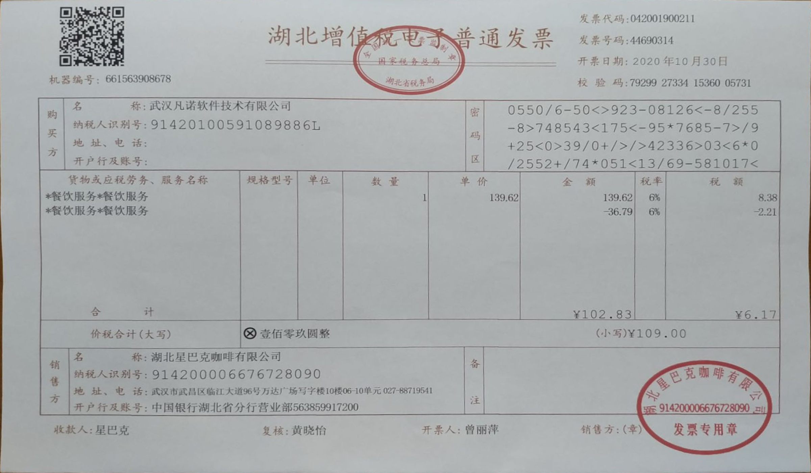

# 发票OCR

项目参考自:
https://github.com/SanLiWuXun/ReceiptAutoInfoExtract
https://github.com/colorofnight86/eisms-ocr
并因为OpenCV版本更新导致原功能无法使用且输出为无效字符串，在此基础上更新

## 1.原始图像：

现实中，我们拍照不可能像扫描那样端正，图片中的票据总会有这样那样的视角上的歪斜，使用这样的图片直接来识别极易出错，为了提高识别的准确性，我们需要先将图片预处理为扫描样式的正视图，并将不属于票据的图片部分剪切掉。

这里的图片必须包含发票的四周，背景与发票的对比需要比较明显，否则会影响步骤2的轮廓识别。

## 2.二值化图像并通过边缘识别选出最大轮廓：
参考相关资料本项目采用“整体图片边缘检测”（采用cv2.Canny函数）对图像进行二值化处理。

使用“票据轮廓检测”（采用cv2.findContours函数），得到所需处理票据的轮廓，确定票据的四个顶点。

## 3.原始图片视角变换及裁剪：

根据上述步骤确定的顶点，使用cv2.getPerspectiveTransform和cv2.warpPerspective对于原始图片进行透视变换得到相应的票据的正视图。

## 4.根据已知位置识别相应文字：

简单起见，这里通过标准发票样式提前确定了各项信息的位置，直接在上述正视图图片中截取对应的区域的方式找到相应信息的图片（见下图），根据不同的文字类型，通过cnocr库对于得到的区域图片进行文字识别。

发票码、购买方和销售方三个大面积区域，原项目采用的是分成四小块识别，但是从实际识别情况来看，不同角度以及不同发票的文字位置都会有上下偏移，导致小区块的识别率急剧下降。

因此该项目对原项目所使用的方法进行优化，通过整体识别一整块大区域，然后拆分成四块内容，并对不同信息所识别出的内容进行针对性的纠正，有效提高了识别率。

识别信息如下

## 5.更新内容

1. ocr.ocr()函数返回字典，需要使用result['text']获取文本内容
   
参考：https://github.com/Chandler-Lu/alfred-ocr/issues/14

3. cv2.line()需传入astype(int)点位，否则报错
   
参考：https://forum.opencv.org/t/overload-resolution-failed-can-t-parse-pt1-sequence-item-with-index-0-has-a-wrong-type/12741
